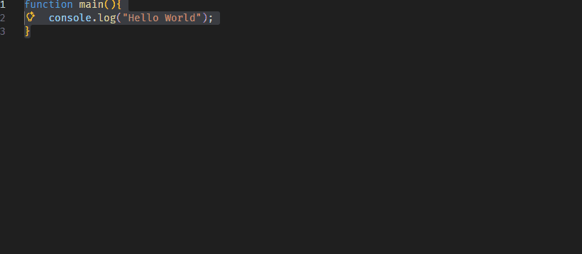

Code Stringify Tools

Convert selected JavaScript/JSON code into an escaped string and back — quickly and safely.

✨ Features

Convert selected code to a JSON-escaped string

Convert an escaped JSON string back to normal code

Replace selection or copy result to clipboard

Quick access via context menu

Keyboard shortcut for fast stringify + copy

🚀 Usage

Example: 

1️⃣ Stringify (Replace Selection)

Select any code:

function main() {
  console.log("Hello World!");
}

main();

Run:

Stringify: Replace Selection

Result:

"function main() {\r\n  console.log(\"Hello World!\");\r\n}\r\n\r\nmain();"

2️⃣ Stringify (Copy Only)

Select code and run:

Stringify: Copy

The escaped string will be copied to your clipboard.

3️⃣ Destringify (Replace Selection)

Select a valid JSON string:

"console.log(\"Hello World\")"

Run:

Destringify: Replace Selection

It converts back to normal code.

4️⃣ Destringify (Copy Only)

Same as above, but copies the parsed result instead of replacing.

⌨️ Keyboard Shortcut
Ctrl + Alt + C

Stringifies the selected code and copies the result to the clipboard.

📦 Supported Formats

JavaScript

JSON strings

Uses:

JSON.stringify

JSON.parse

⚠️ Important

The destringify command requires a valid JSON string.

If the selection is invalid, an error message will be shown.

Empty selections are ignored.

🛣 Roadmap

Future improvements may include:

Language-specific string formats (C#, SQL, etc.)

Smart detection of stringified content

Submenu grouping for cleaner context menu

Configurable formatting options

🧑‍💻 Author

Developed as a lightweight productivity tool for developers who frequently need to escape and unescape code snippets.